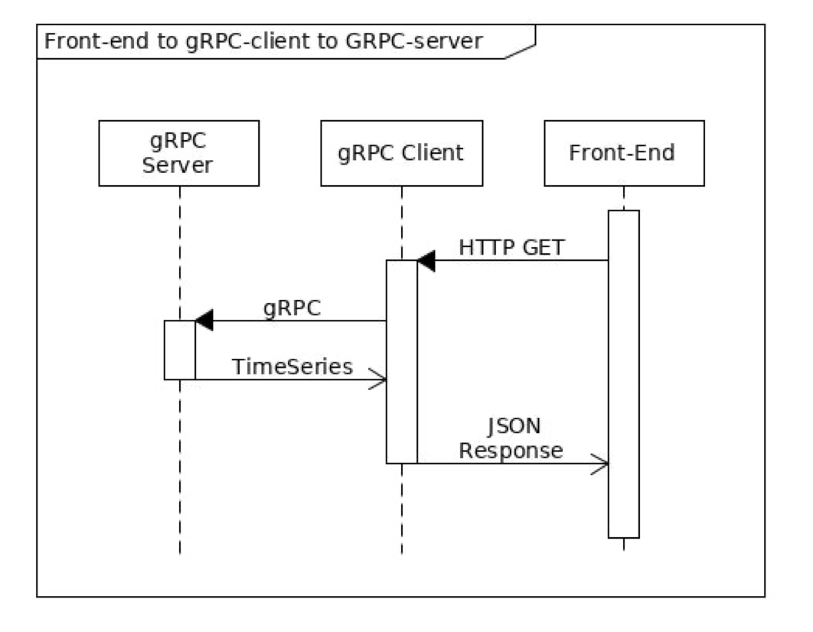

# gRPC based micro-service

## Introduction

gRPC [https://grpc.io/](https://grpc.io/) (Google Remote Procedure Call Framework)

- This project uses gRPC to implement protocol buffers which is a powerful and efficient framework
  to implement API's. Protocol buffers can be applied across various languages and platforms for serializing structured data into raw bytes. Huge advantage about this feature is that the client can access the methods of a remote server as if it were a object from the local system also called `stubs`
- Example proto file:

```bash
  // The Booking service definition.
  service Booking {
  // Sends a Booking
      rpc MakeBooking (BookingRequest) returns (BookingResponse) {}
  }
  // The request message
  message BookingRequest {
  string user_name = 1;
  int64 request_timestamp = 2;
  int64 slot_timestamp = 3;
  int64 mobile_number = 4;
  }
  // The response message
  message BookingResponse {
  string message = 1;
  }
```

## Architecture



## Implementation

### gRPC backend

- `serve()` is used to start the gRPC server and will wait until termination`(grpc_backend/grpc_backend_server.py)`.

- `add_MeterServicer_to_server()` function exposed by protoc is used to subscribe Meter as a service on the gRPC server. `(grpc_backend/grpc_backend_server.py)`.

### Flask middleware

- `server()` function defined in `(flask_middleware/app.py)`

- `MeterRequest` class exposed by protoc is used to request the gRPC server for streaming `(flask_middleware/app.py)`

- `MeterStub` class exposed by protoc is used to call the service `ReadMeter` with a request `MeterRequest`(:9090)`(flask_middleware/app.py)`

- `Readmeter` method exposed by protoc is used to make request to the gRPC server which responds back with `MeterReading` `(flask_middleware/app.py)`

- `MeterReading` class exposed by protoc is used to serve response from RPC streaming. (flask_middleware/read_csv.py)

### React Frontend

- `App()` is the main functional component which renders our frontend app

- `MeterDataPlot()` functional component renders the JSON response of the meter readings from the flask server (:5000)

## Execution

## Option 1: Start all servers using docker (Recommended!)

Inside the root directory (`spectral-assignment`) of the project.

```bash
docker compose up
```

## Pre-requisites for running bash scripts

- `virtualenv`

- `Python 3.9.1`

## Option 2: Start all servers using a bash script

Inside the root directory (`spectral-assignment`) of the project.

```bash
bash run_app.sh
```

## Option 3: Start each server independently using a bash script

Inside the `grpc_backend` directory of the project.

```bash
bash run_grpc.sh
```

Inside the `flask_middleware` directory of the project.

```bash
bash run_flask.sh
```

Inside the `react_frontend/meter-reading-app` directory of the project.

```bash
bash run_react.sh
```

## Option 4: Start servers independently

Inside the root directory (`spectral-assignment`) of the project.

## Step 1. Start the gRPC server

```bash
cd grpc_backend
```

```bash
virtualenv -p 3.9.1 venv
```

```bash
source $PWD/venv/bin/activate
```

```bash
pip install -r 'requirements.txt'
```

```bash
python grpc_backend_server.py
```

## Step 2. Start the flask middleware server

```bash
cd ../flask_middleware
```

```bash
virtualenv -p 3.9.1 venv
```

```bash
source $PWD/venv/bin/activate
```

```bash
pip install -r 'requirements.txt'
```

```bash
python app.py
```

## Step 3. Start the react frontend server

```bash
cd ../react_frontend
```

```bash
npm install
```

```bash
npm start
```

## Charts

There are two visual representation of data in the UI

- gRPC meter reading: Get meter reading data of all data point in the CSV from the middleware server which can be zoomed and paned.
- Hourly meter reading frequency: Get meter reading frequency of the hours (00:00 - 24:00). Helps in knowing peak hours.

Open [http://localhost:3000](http://localhost:3000) to view it in your browser.
